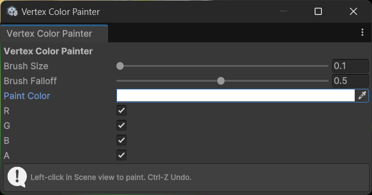

# 🎨 Mesh Vertex Color Painter for Unity
A simple Unity Editor tool that allows direct vertex color painting on meshes without requiring colliders.

## ✨ Features
✅ Paint vertex colors directly in the Scene view

✅ No collider required – works with raw meshes

✅ Fully supports Undo / Redo via Ctrl+Z / Ctrl+Y

✅ Adjustable brush size, falloff, and paint color

✅ Lightweight, reflection-based raycasting (no modification to meshes needed)

✅ Color component mask

## 🔧 Usage
Open via menu: Window > Mesh Vertex Color Painter

Select a GameObject with a MeshFilter

Paint in the Scene view using Left Mouse Button

Press Ctrl+Z to undo your paint strokes
